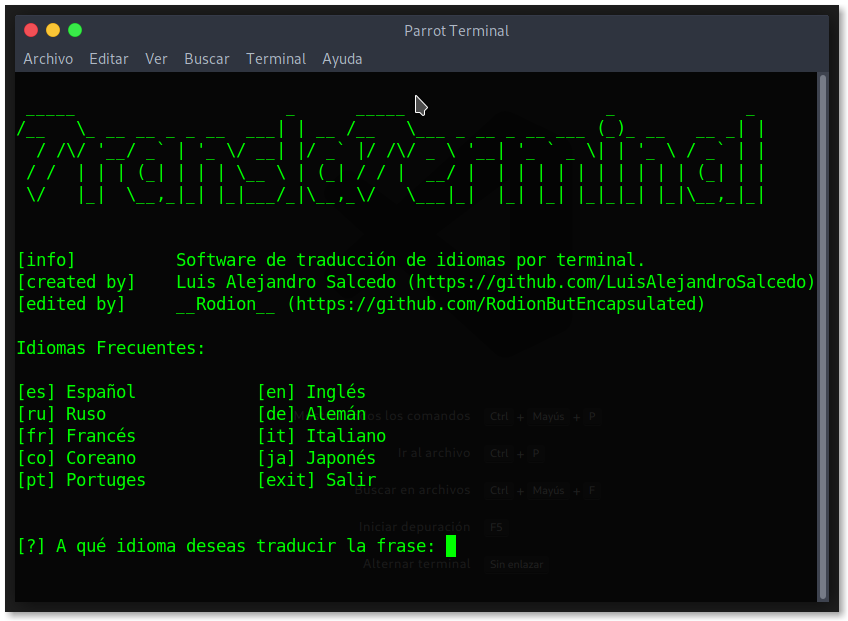

# TranslaTerminal
Un traductor de idiomas hecho en Python3 en modo terminal para linux.

<p align="left">


</p>

## Como instalar:
* Linux
```
git clone https://github.com/RodionButEncapsulated/TranslaTerminal.git
cd TranslaTerminal/
pip3 install -r requirements.txt
python3 translaterminal.py
```
* Windows
```
git clone https://github.com/RodionButEncapsulated/TranslaTerminal.git
cd TranslaTerminal/
pip3 install -r requirements.txt
python3 translaterminal.py
```

* Google Colab
```
!git clone https://github.com/RodionButEncapsulated/TranslaTerminal.git
%cd TranslaTerminal
!pip install -r requirements.txt
!python3 translaterminal.py
```

## Requisitos:

Para que el programa funcione correctamente, será **necesario instalar** las siguientes **librerias**:

* [requests](https://pypi.org/project/requests/ "Ir a requests en PyPI"): Para realizar solicitudes a Google Translate.
* [pyperclip](https://pypi.org/project/pyperclip/ "Ir a pyperclip en PyPI"): Para copiar las traducciones realizadas al portapapeles.

```
pip install -r requirements.txt
```

## Como usarlo:
* Al ejecutarse, el programa solicitará el código de un idioma para traducir el texto. Arriba mostrará ejemplos de cómo ingresar el **idioma** deseado en formato “[código] Idioma”.
Sólo debe ingresar el **código**. Por ejemplo, sí se desea traducir al **inglés** se debe ingresar el código **en**.
* Luego se solicitará el texto a traducir, el cual pueden ser frases o palabras.
* Finalmente se mostrará:
```
[Resultado] Frase Traducida (Copiado al portapapeles)
```
La frase traducida se encontrará disponible en el portapapeles para poder pegarla (Ctrl+v) donde se desee.
